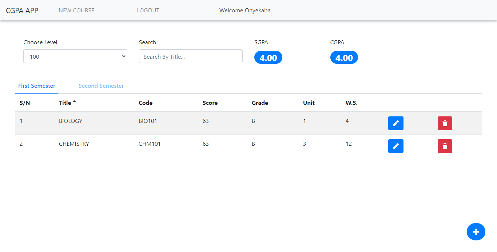

# REACT CGPA APP

It is a fullstack app which allows registered users to calculate their CGPA and SGPA which is stored on the database.  
This is frontend source code for the app. For the backend source click [here](https://github.com/Ekenzy-101/Node-Cgpa-Api)
This project was bootstrapped with [Create React App](https://github.com/facebookincubator/create-react-app).

## LIVE DEMO

[Demo](https://kenzyreactcgpa.herokuapp.com/)

## TECHNOLOGY STACKS

- React
- Node
- Express
- MongoDB

## SETUP

- Make sure you have your server setup. [For more info click here](https://github.com/Ekenzy-101/Node-Cgpa-Api)
- Clone this repo by typing `git clone <repo url>`
- Go to the directory of repo by typing `cd <name of folder>`
- Type `npm install` to install all dependencies
- Set these environment variables - REACT_APP_API_URL
  On Mac:
  `export REACT_APP_API_URL=<Your Server Connection String>`

  On Windows:
  `set REACT_APP_API_URL=<Your Server Connection String>`
